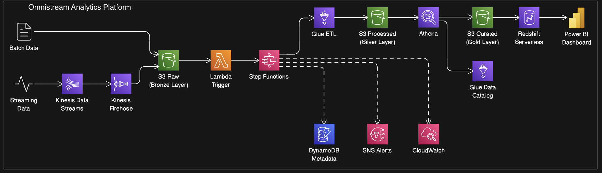
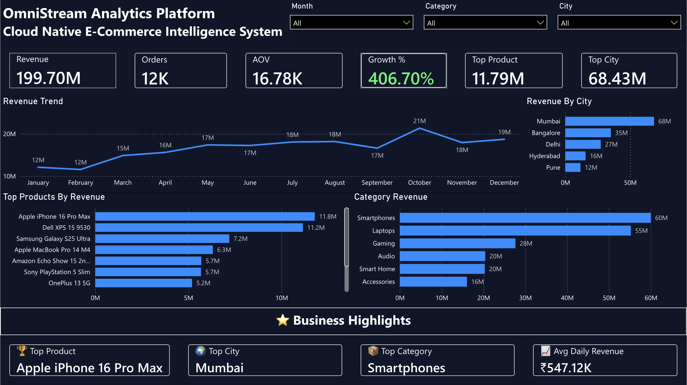

# OmniStream Analytics Platform  
Cloud-Native Data Engineering & Business Intelligence System

OmniStream is an end-to-end AWS-powered analytics platform that simulates a modern e-commerce data ecosystem. The project demonstrates how raw batch and streaming data can be ingested, transformed, stored and visualized through a scalable cloud-native architecture.

The platform combines Data Engineering, Cloud Computing, Data Warehousing and Business Intelligence to deliver actionable insights for business users.

## 📌 Project Overview

The objective of OmniStream is to build a production-style analytics platform capable of:

- Processing batch and streaming data
- Automating ETL workflows
- Implementing a Bronze → Silver → Gold data lake architecture
- Building analytics-ready datasets
- Serving business intelligence dashboards

The pipeline processes 50,000+ transactional records and transforms raw operational data into curated datasets that power executive-level reporting and analytics.

---

## 🏗 Architecture



### High-level Flow:

Batch Files → S3 Raw (Bronze Layer)  

Streaming Data → Kinesis → Firehose → S3 Raw  

S3 Raw → AWS Glue ETL → S3 Processed (Silver Layer)  

S3 Processed → Athena CTAS → S3 Curated (Gold Layer)  

S3 Curated → Amazon Redshift  

Amazon Redshift → Power BI Dashboard  

Entire workflow orchestrated using AWS Step Functions and triggered automatically via S3 events and AWS Lambda.

---

## ⚙ Technology Stack

### Cloud & Storage
- Amazon S3 (Data Lake – Bronze, Silver, Gold layers)
- AWS IAM

### Streaming
- Amazon Kinesis Data Streams
- Amazon Kinesis Firehose

### Data Processing
- AWS Glue (PySpark ETL)
- AWS Lambda

### Orchestration
- AWS Step Functions

### Analytics & Querying
- Amazon Athena
- AWS Glue Data Catalog

### Data Warehouse
- Amazon Redshift Serverless

### Monitoring & Metadata
- Amazon CloudWatch
- Amazon DynamoDB
- Amazon SNS

### Business Intelligence
- Microsoft Power BI

---

## 📂 Project Structure
```
aws-unified-analytics-pipeline/
├── architecture/
├── ingestion/
├── etl/
├── orchestration/
├── analytics/
├── warehouse/
├── dashboard/
└── README.md
```
---

## 🔄 Pipeline Features

- Batch Data Ingestion
- Real-Time Streaming Ingestion
- Serverless ETL Processing
- Bronze / Silver / Gold Data Lake Architecture
- Workflow Orchestration
- Automated Monitoring & Alerting
- Data Warehousing with Amazon Redshift
- Interactive Business Intelligence Reporting

---

## 📊 Power BI Dashboard

The analytics layer provides business users with executive-level visibility into sales performance, revenue trends, product analytics and geographic performance.

### Dashboard Capabilities

- Revenue Trend Analysis
- Revenue Growth Monitoring
- Product Performance Tracking
- Category Analysis
- City-Level Revenue Analysis
- Executive KPI Reporting
- Interactive Filtering

### Dashboard Preview



---

## 🚀 End-to-End Workflow

1. Raw batch and streaming data is ingested into Amazon S3 (Bronze Layer)
2. AWS Lambda automatically triggers the processing workflow
3. AWS Step Functions orchestrate the ETL pipeline
4. AWS Glue transforms and cleans raw datasets
5. Processed data is stored in the Silver Layer
6. Amazon Athena creates curated analytics datasets
7. Curated data is stored in the Gold Layer
8. Amazon Redshift serves as the analytics warehouse
9. Power BI visualizes business insights through interactive dashboards

---

## 💡 Skills Demonstrated

### Data Engineering

- ETL Pipeline Development
- Data Lake Architecture
- Data Warehousing
- Batch Processing
- Streaming Data Processing
- Data Transformation

### Cloud Engineering

- AWS Architecture Design
- Serverless Computing
- Workflow Automation
- Monitoring & Alerting

### Analytics

- SQL Analytics
- Business Intelligence
- KPI Design
- Dashboard Development

---

## 🎯 Why This Project Matters

OmniStream demonstrates how modern organizations transform raw operational data into business intelligence through a scalable cloud-native architecture.

The project bridges the gap between Data Engineering and Analytics by showcasing the complete journey from data ingestion to executive decision-making.

---

## 👤 Author

Vinit Vajani  

Data Engineer | AWS | Python | SQL | ETL Pipelines  

LinkedIn: https://www.linkedin.com/in/vinitvajani

GitHub: https://github.com/vinitvajani
